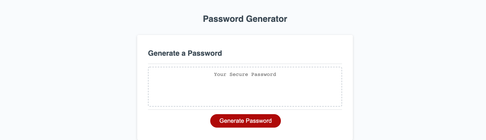

# password-generator
An employee needs to access sensitive data. In order that the employee can create a strong password that provides greater security, the source code in this repository randomly generates a password that meets user selected criteria.

## Description of Work
1. When the user clicks the button to generate a password, they are for the length of the password.
2. If the the length of the password is less than 7, or greater than 128, or not number, they are alerted with a message and prompted for the length of the password again.
3. When a valid length is entered, then the user presented with a series of prompts for password criteria.
4. When asked for character types to include in the password the user confirms whether or not to include lowercase, uppercase, numeric, and/or special characters.
5. The input is validated such that at least one confirmed character type is selected.
6. If no character types are selected, the user is alerted with a message and prompted with the series of password criteria again. 
7. When at least one character type is selected, then a password is generated that matches the selected criteria.
8. When the password is generated, then the password is written to the page.

## Screenshot of Browser

## Link to deployed page
https://jooreea.github.io/password-generator/